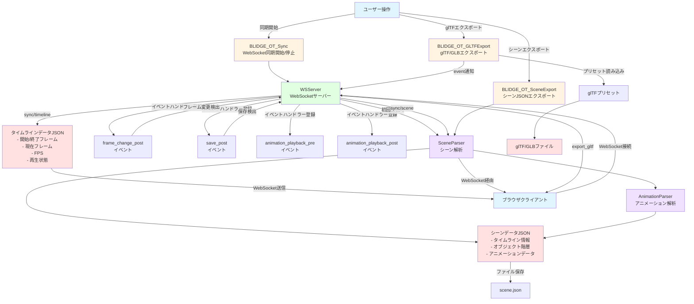
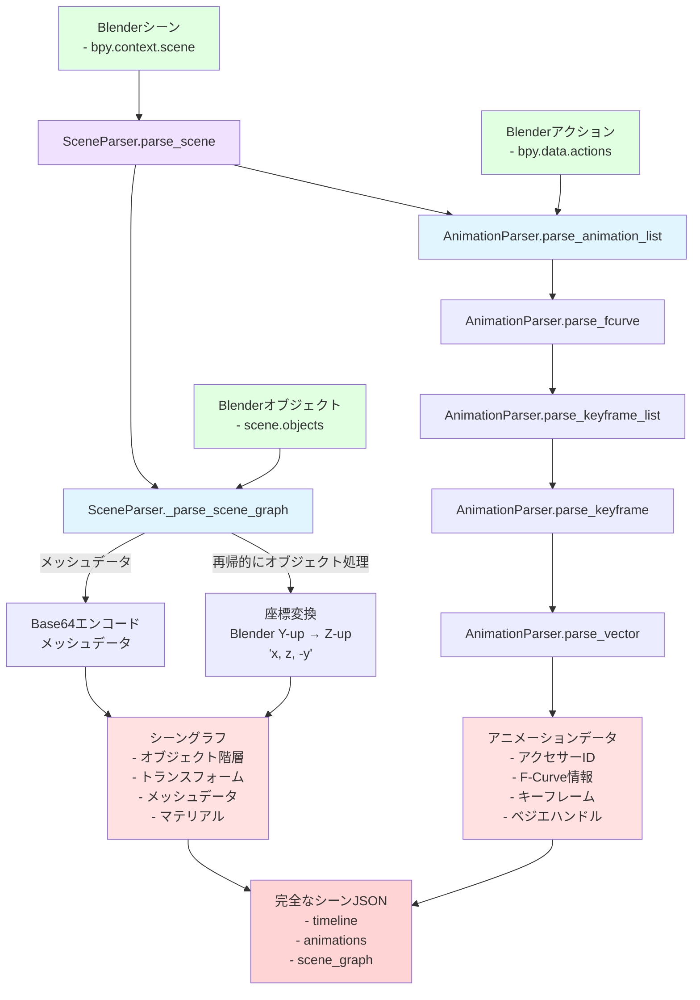
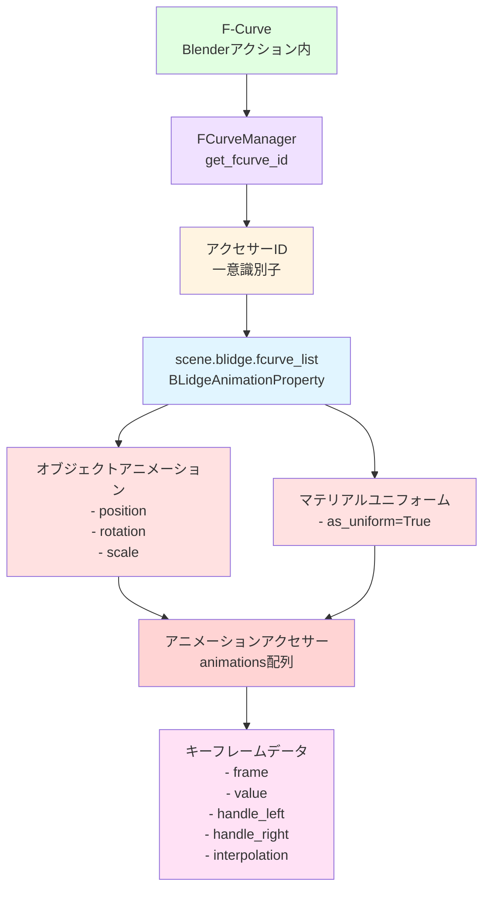
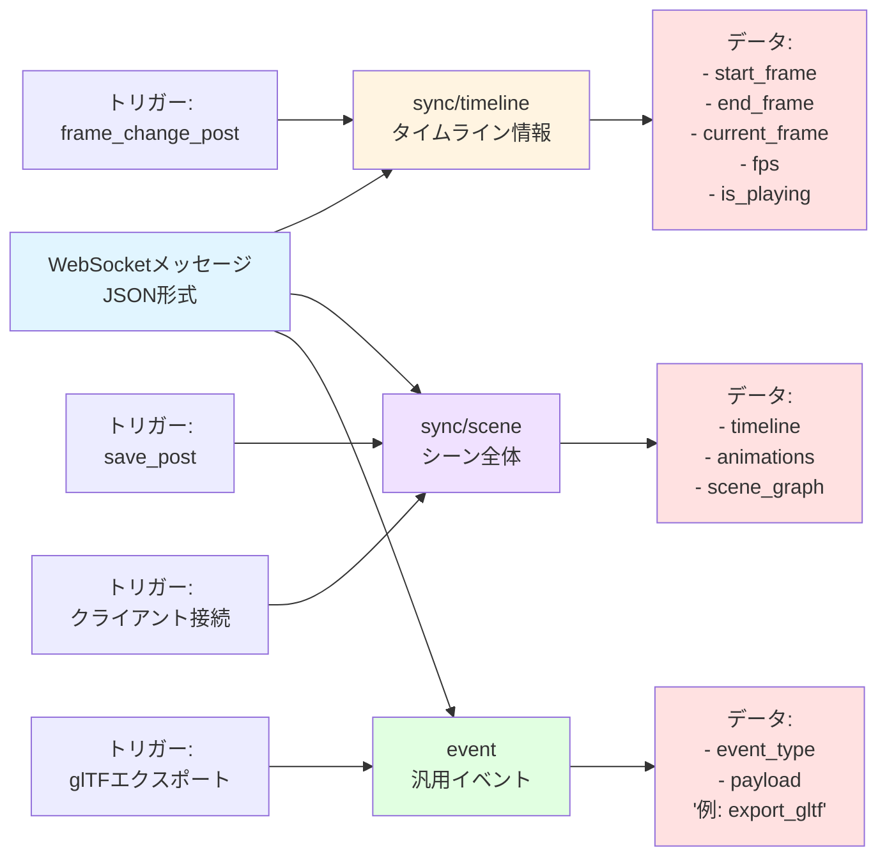
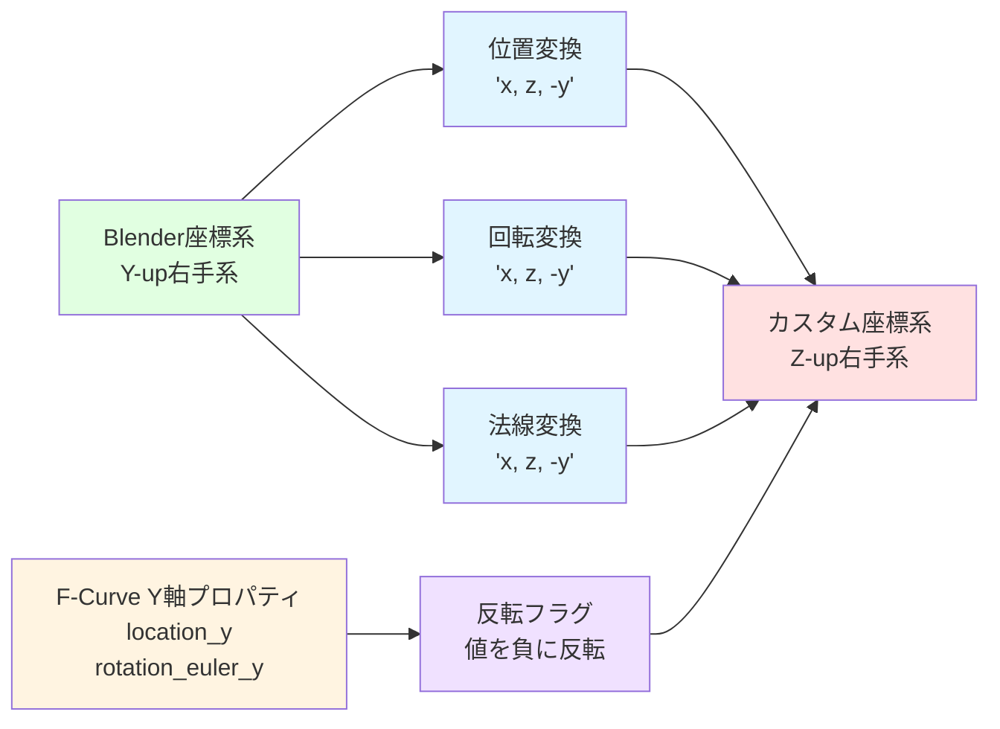

# BLidge データフローとエクスポート関係図

## シーンエクスポートと WebSocket 同期フロー

## シーン解析パイプライン詳細

## アニメーションデータ共有システム

## WebSocket メッセージタイプ

## 座標系変換

## 注釈

### エクスポートフロー

1. **WebSocket 同期**: リアルタイムでブラウザと Blender を同期
2. **シーンエクスポート**: 完全なシーンデータを JSON 化
3. **glTF エクスポート**: 標準フォーマットでメッシュ/アニメーションを出力

### データ変換

- **座標系**: Blender (Y-up) → カスタム (Z-up) に変換
- **メッシュデータ**: Base64 エンコードで効率的に転送
- **アニメーション**: ベジエハンドル情報を含む完全なキーフレームデータ

### アクセサーシステム

- F-Curve に一意のアクセサー ID を割り当て
- オブジェクトアニメーションとマテリアルユニフォームで共有
- データ重複を避け、効率的なエクスポートを実現
